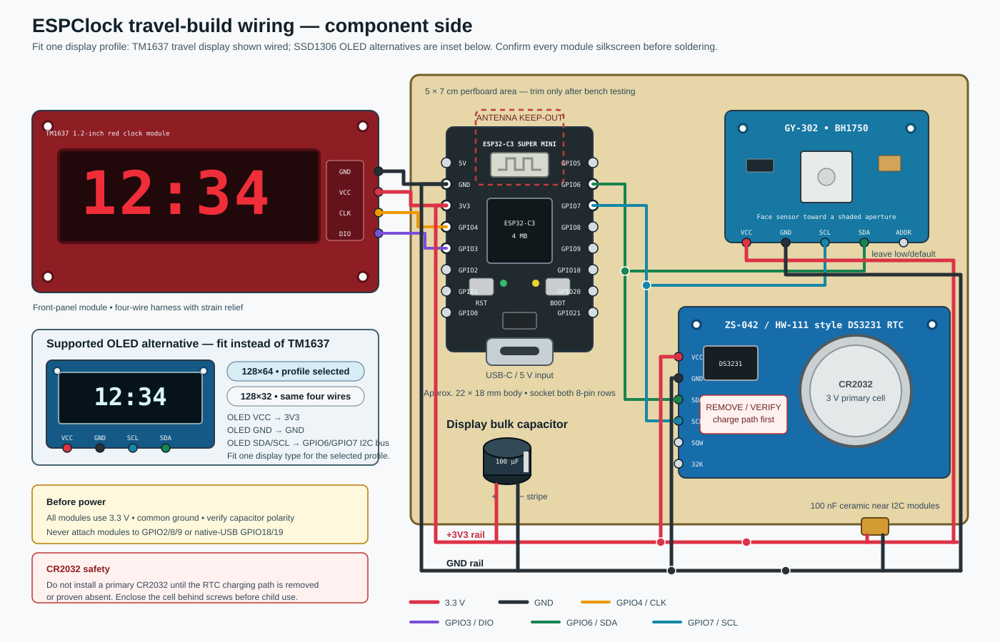

# ESPClock

A small, child-friendly travel clock: plug it into USB-C and it immediately shows the best time it has, then quietly tries to improve it from an authorized phone or the Internet.

The reference solderless prototype uses a **full-size 38-pin ESP32 DevKit**, a
**0.96-inch 128x64 I2C OLED**, and a **BH1750/GY-302**. A DS3231 is optional for
this bring-up: once synchronized, the ESP keeps time while USB power remains
connected. The compact travel build uses an **ESP32-C3 Super Mini**, preferably
with a larger 1.2-inch TM1637 display and a battery-backed DS3231 after the
behavior has been proven on the bench.

## What it does

1. Reads UTC from a DS3231 when one is fitted and valid; otherwise it starts
   without inventing a time and waits for a synchronization source.
2. Advertises `KidsClock-xxxx` over BLE. The included iPhone companion app writes UTC plus the current UTC offset, reconnects in the background, and answers six-hour sync requests.
3. If BLE has not already synchronized this boot, starts a two-minute no-install Wi-Fi portal named `KidsClock-xxxx` after the two-minute onboarding window. Joining it lets the phone browser transfer its time and offset automatically, including after travel.
4. As a last resort, tries open Wi-Fi access points in signal-strength order, never retrying a failed BSSID in the same boot, and requests UTC from NTP.
5. Keeps time in the ESP while powered, mirrors it to an available RTC, and
   silently reopens bounded synchronization opportunities every six hours.
6. Samples room light about once per second, filters it over several seconds, and adjusts the display through eight brightness levels.

Radio failures never stop the clock or blank a valid display.

## Important phone/Bluetooth reality

Approving a Bluetooth pairing authorizes a connection; it does not universally make a phone publish its clock or Internet connection.

- Android does not expose the BLE Current Time Service as a universal system service.
- Generic BLE accessories usually need a phone app to initiate their custom GATT exchange.
- The ESP32-C3 has BLE, not Bluetooth Classic PAN, so it cannot consume Bluetooth tethering.
- NTP provides UTC only. It does not reveal the local timezone.

The repository therefore includes an iOS 18+ [companion app](ios/README.md), an encrypted/bonded BLE write service, and a universal no-app captive-portal fallback. The app uses AccessorySetupKit onboarding and a long-lived low-duty connection so the clock can request time about every six hours. The portal remains the reliable no-install path on a new phone. Open Wi-Fi/NTP refreshes UTC but retains the last phone-confirmed UTC offset. Concurrent updates are arbitrated atomically in the order BLE, portal, then NTP, so a lower-trust callback cannot overwrite a pending higher-trust update.

This is an honest limit of phone operating systems and profiles, not an ESP32 coding omission. See [hardware research](docs/hardware-research.md) and the [adversarial design review](docs/design-review.md) for sources and deeper tradeoffs.

## Hardware choice

| Board option | Wi-Fi | Bluetooth | Size/fit | Decision |
|---|---:|---:|---|---|
| **ESP32 38-pin** | **Yes** | **Classic + BLE** | Breadboard-friendly, usually Micro-USB | **Selected for the first solderless prototype** |
| **ESP32-C3 Super Mini** | **Yes** | **BLE 5** | **About 22.5 × 18 mm, USB-C** | **Selected** |
| S2 Mini | Yes | No | Small | Rejected: no Bluetooth |
| C6 Mini N4 | Yes, including Wi-Fi 6 | BLE 5.3 | Small | Works, but its extra radios add no clock benefit |

The C3 has enough GPIO, flash, RAM, and radio capability without the size of
the 38-pin board, so it remains the travel target. The firmware has distinct,
pin-safe PlatformIO profiles for both board families and for TM1637, SSD1306
128x64, and SSD1306 128x32 displays.

For OLED bench bring-up, start with the **0.96-inch 128x64** unit. The narrow
0.91-inch module is normally 128x32; with the same 128-pixel width but half as
many rows, its digits are substantially shorter. Neither tiny OLED is
guaranteed readable from two metres, and continuously displayed OLED pixels can
age, so the physical distance/night test decides whether either is suitable for
the final clock. The display backend is modular, so that test does not lock the
firmware to one screen.

## Bill of materials

Prices were checked on **2026-07-25** and are approximate. This regional
snapshot uses UAE prices in AED for a consistent comparison; it does not assume
contributors are in the UAE. Search links and a more detailed comparison are
in [docs/hardware-research.md](docs/hardware-research.md).

| Qty | Part / role | What to buy | Approx. AliExpress | Approx. Amazon.ae |
|---:|---|---|---:|---:|
| 1 | 38-pin ESP32 DevKit | Reference breadboard target | AED 15–30 | AED 25–55 |
| 1 | 0.96-inch SSD1306 OLED, 128x64 | Default bench display, normally `0x3C` | AED 5–12 | AED 15–35 |
| 1 | 0.91-inch SSD1306 OLED, normally 128x32 | Optional comparison display | AED 4–10 | AED 15–30 |
| 1 | BH1750/GY-302 light sensor | Ambient-light input; default address `0x23` | AED 3–8 | AED 10–30 |
| 1 | ESP32-C3 Super Mini | Compact travel target | AED 9–18 | AED 20–45 |
| 1 | 1.2-inch red TM1637 clock display | Optional final-display candidate; centre colon | AED 15–40 | AED 35–70 |
| 1 | DS3231 RTC module | Optional for bring-up, required for unplugged retention; verify a non-charging CR2032 arrangement | AED 6–15 | AED 20–45 |
| 1 | Branded CR2032 | Primary, non-rechargeable coin cell | AED 2–5 | AED 5–10 |
| 1 | 5 × 7 cm, 2.54 mm perfboard | Single-sided is sufficient | AED 3–7 | AED 10–20/pack |
| 2 | Female socket strips | Socket the C3 | AED 1–3 | AED 8–15/pack |
| 1 each | 100 µF ≥10 V electrolytic; 100 nF ceramic | Local decoupling | AED 1–2 | Usually in an assortment |
| 1 | USB-C cable and certified 5 V/1 A supply | Use a data-capable cable for flashing | Varies | AED 15–35 |
| — | Solid wire, solder, heat-shrink, smoked red window | Workshop consumables | AED 3–8 allocated | AED 10–25 |

A new bench build using the default ESP32/OLED/BH1750 configuration is roughly
**AED 23–50** from AliExpress. A compact travel build with the C3, TM1637,
BH1750, RTC/cell, perfboard, sockets, and decoupling is roughly **AED 40–98**.
Both estimates exclude shipping, enclosure, cable, and power supply.

Optional only if the exact large display fails its 3.3 V acceptance test: a two-channel BSS138 level-shifter module, approximately AED 2–8.

## Wiring

For the first solderless test, power the OLED and BH1750 from the full-size
ESP32's regulated **3.3 V** rail:

| 38-pin ESP32 | Connect to | Notes |
|---|---|---|
| `3V3` | OLED `VCC`; BH1750 `VCC`; optional DS3231 `VCC` | Keep every I2C pull-up at 3.3 V |
| `GND` | Every module `GND` | One common ground |
| GPIO21 | OLED `SDA`; BH1750 `SDA`; optional DS3231 `SDA` | Shared I2C data |
| GPIO22 | OLED `SCL`; BH1750 `SCL`; optional DS3231 `SCL` | Shared I2C clock |
| GPIO0 | Existing BOOT button only | Five-second powered-on recovery gesture |

Follow the labels printed on the board. Many 38-pin DevKits occupy nearly the
whole breadboard width; use two joined breadboards or jumper one pin row to a
second breadboard if necessary.

The compact TM1637 travel wiring remains:

| ESP32-C3 pin | Connect to | Notes |
|---|---|---|
| `3V3` | TM1637 `VCC`; BH1750 `VCC`; DS3231 `VCC` | Never connect to 5 V |
| `GND` | Every module `GND` | One common ground |
| GPIO4 | TM1637 `CLK` | Dedicated display bus |
| GPIO3 | TM1637 `DIO` | Dedicated display bus |
| GPIO6 | BH1750 `SDA`; DS3231 `SDA` | Shared I2C data |
| GPIO7 | BH1750 `SCL`; DS3231 `SCL` | Shared I2C clock |

Do not attach modules to C3 strapping pins GPIO2/8/9 or native-USB GPIO18/19.
The 128x64 or 128x32 OLED can replace the TM1637 on the C3 by joining it to the
same GPIO6/7 I2C bus.



The complete net list, schematic, continuity procedure, level-shifter fallback, and mechanical notes are in [hardware/wiring.md](hardware/wiring.md).

### Mandatory RTC safety check

Many cheap blue ZS-042/HW-111 DS3231 modules try to charge the coin cell through a resistor and diode. A CR2032 is **not rechargeable**.

Before installing a CR2032:

1. prove the module has no charging path, or remove its charge resistor/diode;
2. power the RTC at 3.3 V without a cell and inspect/measure the holder;
3. install the cell, re-power, and verify its voltage is not being driven upward;
4. place it behind a screwed enclosure where a child cannot reach it.

Do not build the clock if this check is uncertain.

### Display voltage acceptance

Running a red TM1637 module at 3.3 V is simple and prevents 5 V pull-ups from reaching the ESP. The TM1637 manufacturer's guaranteed electrical table is specified at higher voltage, so the exact purchased 1.2-inch module must pass:

- repeated cold starts;
- all-segments/full-brightness operation during Wi-Fi transmit;
- two-metre daylight readability;
- minimum-brightness dark-room comfort.

If it fails, follow the 5 V plus BSS138 level-shifter alternative in [hardware/wiring.md](hardware/wiring.md). Never connect a 5 V-powered TM1637 module directly to C3 pins.

## Breadboard bring-up

1. Place the full-size ESP32 on a breadboard and connect the 0.96-inch OLED and
   BH1750 using GPIO21/22. Leave the DS3231 disconnected.
2. Flash `esp32-devkit-oled-128x64`, synchronize from the iPhone app or portal,
   and confirm the clock continues while USB stays powered.
3. Power-cycle it without an RTC. It must return to `PAIR`/`----`, then accept a
   new synchronization normally.
4. Compare the 0.91-inch screen using the separate 128x32 firmware profile.
5. Only then add and qualify a DS3231. Leave the CR2032 out until its charging
   path check is complete.
6. Exercise every brightness level and perform the two-metre/daylight and
   dark-bedroom tests before choosing the final display.
7. Bench-test for at least 24 hours before choosing the compact hardware.

## Later travel assembly

1. Socket the C3 on perfboard with its antenna end at or beyond the board edge.
2. Put the BH1750 at a clear front/top aperture, shaded from the display.
3. Fit 100 µF across display `3V3`/`GND` and 100 nF near the I2C modules.
4. Solder the final wiring and add strain relief; do not leave Dupont jumpers
   in the travel unit.
5. Repeat the 24-hour, radio, brightness, and cold-start tests before designing
   the case.

Do not pot the first build. If later reinforcement is useful, use printed clips or electronics-safe neutral-cure silicone. Keep the antenna, USB-C connector, sensor aperture, socketed ESP, and coin cell clear and serviceable.

## Build and flash

Host requirements:

- [uv](https://docs.astral.sh/uv/)
- a data-capable cable matching the selected board (normally Micro-USB for the
  full-size DevKit and USB-C for the C3);
- for classic DevKit clones, the CP210x or CH340 USB-UART driver if macOS does
  not already recognize it; the C3 uses its native USB serial/JTAG interface.

All Python tooling is pinned in `pyproject.toml` and `uv.lock`; do not install PlatformIO globally.

```sh
uv sync
uv run pio test -e native
uv run pio run -e esp32-devkit-oled-128x64
uv run pio run -e esp32-devkit-oled-128x64 --target upload
```

PlatformIO normally detects the serial port. If several boards are connected:

```sh
uv run pio device list
uv run pio run -e esp32-devkit-oled-128x64 --target upload \
  --upload-port /dev/cu.SLAB_USBtoUART
```

Other common classic-board port names are `/dev/cu.usbserial-*` and
`/dev/cu.wchusbserial*`; C3 boards commonly appear as
`/dev/cu.usbmodemXXXX`.

Open the serial monitor:

```sh
uv run pio device monitor --baud 115200
```

Normal firmware profiles are optimized release builds and compile application
serial diagnostics out. For a temporary bench build, add
`-D CLOCK_ENABLE_DIAGNOSTICS=1` to the affected profile's `build_flags`, rebuild,
and monitor at 115200 baud. Remove the flag before producing a deployment
image. ESP ROM boot messages can still appear independently of the application
diagnostics flag.

If a clone does not enter download mode automatically, hold its `BOOT` button, tap `RESET`, release `BOOT`, and retry the upload. These buttons are not used in normal clock operation. The existing BOOT button also provides the deliberate recovery gesture described below.

The default build is the full-size ESP32 + 128x64 OLED bench profile. Available
profiles are:

| PlatformIO environment | Board and display |
|---|---|
| `esp32-devkit-oled-128x64` | 38-pin ESP32, 0.96-inch 128x64 OLED |
| `esp32-devkit-oled-128x32` | 38-pin ESP32, likely geometry of the 0.91-inch OLED |
| `esp32-devkit-tm1637` | 38-pin ESP32, TM1637 on GPIO25/26 |
| `esp32-c3-oled-128x64` | C3, 128x64 OLED |
| `esp32-c3-oled-128x32` | C3, 128x32 OLED |
| `esp32-c3-super-mini` | C3 travel target, TM1637 on GPIO4/3 |

OLED resolution cannot be identified reliably over I2C. If the 0.91-inch
module is blank or malformed with the 128x32 profile, verify its controller,
address, and listing rather than adding runtime guessing. The default address
is `0x3C`; override `CLOCK_OLED_ADDRESS=0x3D` in a profile if an I2C scan proves
that address.

## Install the iPhone companion

The native Swift companion lives in `ios/` and requires iOS 18 or newer. Open
`ios/ESPClockCompanion.xcodeproj`, select a signing team and your physical
iPhone, then press **Run**. It contains no third-party packages, account,
location permission, network service, advertising, or analytics.

Power-cycle the clock immediately before tapping **Add Kids Clock**. Apple's
accessory picker handles the required phone-level approval. Leave automatic
sync enabled on one family iPhone and do not force-quit the app; the clock will
ask that connected app for fresh time about every six hours. See the
[complete iPhone install, behavior, recovery, and test guide](ios/README.md).

## First use

### RTC already contains valid time

- The clock displays it immediately.
- `PAIR` appears briefly during the two-minute BLE-first/onboarding opportunity.
- BLE advertising remains available for already bonded clients even after the normal time display returns. It uses the proven 30–60 ms discovery cadence during the two-minute onboarding window, then an 800–1000 ms low-duty cadence for later reconnects. New, unbonded phones are accepted for two minutes after boot so Apple's accessory picker has time to complete.
- If BLE has not already synchronized, the two-minute `KidsClock-xxxx` portal is offered after two minutes so another phone can update the timezone without an app. Valid time remains visible most of the time.
- If no phone supplies a fresh time, the clock then tries last-resort open Wi-Fi/NTP.

### RTC is new, missing, or lost power

1. The display shows `PAIR` while BLE advertises.
2. After two minutes, it shows `SEt` and starts the open Wi-Fi AP `KidsClock-xxxx`.
3. On a phone, join that network. Its captive page should open and set the clock automatically.
4. If it does not open, browse to [http://192.168.4.1](http://192.168.4.1) and tap **Set time now**.
5. The page sends only Unix UTC and the phone's current UTC offset. It sends no account, Wi-Fi password, location coordinate, or personal data.

The setup AP closes after success or after two minutes. With no RTC, the clock
continues from the ESP system clock only until USB power is removed. A later
power cycle deliberately returns to the no-time flow and resynchronizes; the
persisted UTC offset alone is not treated as a valid instant.

### Recover from a badly wrong but plausible RTC

The first accepted synchronization is allowed to correct an uninitialized clock by any amount. After that, a persistent confirmed-sync marker activates the five-minute anti-replay/corruption limit.

If the RTC is later wrong by more than five minutes, leave the clock powered
and hold the board's existing `BOOT` button for five seconds. The OLED shows
`RESET`; the four-digit TM1637 approximates `rSt`. Release the button when the
message appears. The full-size ESP32 uses GPIO0 and the C3 uses GPIO9. The
firmware clears the confirmed-sync marker, stored offset, and BLE bonds and
restarts. Do **not** reset or apply power while BOOT is held; that enters the
board's download loader. After restart, use the BLE window or portal to set the
correct time. The RTC itself is left intact so the screen can continue to show
its best available value until the correction arrives.

This recessed service gesture is not part of normal use. Make the onboard button reachable through a tool/paperclip pinhole in the eventual case.

### After travel to a different timezone

Keep the clock near its authorized iPhone companion; it writes the new time/offset on reconnect. Otherwise, wait two minutes after boot and join the offered `KidsClock-xxxx` setup portal. An NTP-only result refreshes UTC but cannot determine civil timezone by itself.

The current firmware stores a validated offset in 15-minute-capable minutes, not a whole-hour approximation, so zones such as `+05:30` and `+05:45` work. It does not contain the world's timezone/DST database; a phone sync is required after an offset/DST change when the clock has no richer timezone source.

## Display indications

| Display | Meaning |
|---|---|
| OLED `HH:MM`, steady colon | Valid local time; at brightness levels 1–7, even minutes fill the perimeter clockwise and odd minutes erase the same path in 60 equal steps; full-night level 0 switches to a sparse dot-matrix face and suppresses the decorative perimeter |
| TM1637 `HH:MM`, one blink per second | Phone-confirmed local offset this boot |
| TM1637 `HH MM`, brief colon pulse every two seconds | Valid UTC with a retained, not-yet-confirmed timezone offset |
| `PAIR` alternating with time | Boot-time BLE onboarding opportunity |
| `SET` on OLED / `SEt` on TM1637 | No-app phone setup portal is active |
| `WIFI` / seven-segment approximation | Trying an open network/NTP |
| `----` | No trustworthy time is available yet |
| `RESET` on OLED / `rSt` on TM1637 | BOOT recovery button is being held; keep holding for five seconds, then release |

Boot-time setup messages yield to a valid time most of the time. Later periodic
refreshes never replace valid time with `PAIR`, `SET`, `WIFI`, `SYNC`, or any
other radio status. If the authorized phone is away, the clock continues
normally and retries on the next scheduled refresh.

## BLE time service

BLE device name: `KidsClock-xxxx`, where the suffix comes from the ESP chip
identifier.

The legacy BLE payload is deliberately split without truncation. The 27-byte
primary advertisement contains general-discoverable/BR-EDR-unsupported flags,
the complete 128-bit service UUID, and preferred connection intervals. Its
16-byte scan response contains the complete `KidsClock-xxxx` local name. Both
remain below the 31-byte limit. Connectability is part of the advertising PDU;
bondability is an SMP security policy, not an advertising-data flag. The
advertising interval is 30–60 ms while new-phone onboarding is open and
800–1000 ms afterward; changing cadence does not remove the name, service UUID,
connectability, or bonded-client reconnect path.

| Item | UUID |
|---|---|
| Service | `7f510000-1b15-4dc7-9f3f-19b30a6f6a21` |
| Time read/write/notify | `7f510001-1b15-4dc7-9f3f-19b30a6f6a21` |
| Status read/notify | `7f510002-1b15-4dc7-9f3f-19b30a6f6a21` |

Time writes require an encrypted/bonded BLE connection. A client may send either:

- UTF-8 text: `unix_utc_seconds,utc_offset_minutes`
- 12-byte binary packet:

| Byte | Value |
|---:|---|
| 0 | protocol version `1` |
| 1–8 | signed Unix UTC seconds, little-endian |
| 9–10 | signed UTC offset minutes, little-endian |
| 11 | flags; reserved on write |

Accepted epochs are 2024-01-01 through 2099-12-31. Offsets must be between UTC−14:00 and UTC+14:00. Malformed, stale-range, oversized, and trailing-junk payloads are rejected.

The status characteristic reports `time-needed`, `sync-request`, `time-pending`, `time-accepted`, `time-rejected`, `rate-limited`, or `invalid-time`. The included iPhone app connects during the two-minute new-phone window for its first bond, enables status notifications, writes the phone's current UTC/offset, waits for `time-accepted`, and retains a low-duty connection. The firmware reissues `sync-request` when notifications are subscribed and approximately every six hours thereafter. The time characteristic includes both the base GATT write property and its encrypted-write requirement. Status values are exact UTF-8 bytes without a trailing NUL; either contract violation breaks Core Bluetooth interoperability even if the clock applies the payload.

BLE bonding capacity is finite even though any family phone may take a turn. This build provisions **16 bond and notification records** and evicts the first bond returned by NimBLE when full so a new family phone can recover the clock. A pairing attempt at capacity must make room before authentication, so a cancelled attempt may evict one existing bond; the acceptance checklist covers this recovery edge case. “Any number of phones” means the clock is not owned by one account or hard-coded handset, not infinite simultaneous connections. Firmware is compiled for one simultaneous connection, and only one iPhone should leave automatic synchronization enabled at a time; its persistent connection is the active sync owner until the app toggle is turned off or it leaves range.

After the clock has a persistent confirmed-sync marker, phone, portal, and NTP corrections must be within five minutes of its running time. An uninitialized clock is allowed one arbitrary valid correction; the BOOT recovery gesture deliberately reopens that path. This rejects captured old values and arbitrary large forward/backward jumps during normal operation while retaining a no-computer recovery path. BLE writes are also limited to one accepted update per 30 seconds.

BLE uses encrypted **Just Works** bonding because the clock has no input device. The phone shows/owns the approval, but Just Works has no numeric-comparison MITM protection. New unbonded peers are rejected after the two-minute onboarding window. The setup Wi-Fi AP is intentionally open for cross-platform ease, accepts one update, applies the confirmed-clock freshness rule, then shuts down. These controls fit a low-consequence clock, but they are not equivalent to a per-device cryptographic owner secret.

## Open Wi-Fi/NTP fallback

This is deliberately bounded and contains no credentials:

- only scan results explicitly marked open are considered;
- up to six candidates from one scan are retained in signal-strength order,
  avoiding another full radio scan after each failed association;
- a failed **BSSID** is remembered for this boot and never retried;
- if the fixed 24-entry failure table fills, open-Wi-Fi fallback is disabled for the rest of that boot;
- association and NTP have fixed timeouts;
- captive portals are not bypassed and terms are not accepted automatically;
- no SSID/password is saved;
- the station MAC is randomized once per boot before joining opportunistic networks;
- no admin interface, telemetry, OTA, or child/family information is exposed;
- successful NTP updates UTC while retaining the last confirmed offset.

Open networks are untrusted and often unusable without a browser. The feature is a best-effort last resort, not the foundation of correct time. It can be disabled in `platformio.ini`:

```ini
-D CLOCK_ENABLE_OPEN_WIFI_FALLBACK=0
```

## Automatic brightness

The BH1750 is triggered in high-resolution one-shot mode and sampled every
second, returning to its power-down state between measurements. An exponential
filter gives roughly a several-second response and 20% hysteresis prevents
flicker near level boundaries. The normalized eight levels map directly to
TM1637 brightness and to a visibly separated SSD1306 contrast curve. Because
some small OLED modules show little perceived change across their contrast
range, the SSD1306 backend also uses flicker-free spatial dimming. Full-night
level 0 uses contrast code 1, renders each 5×7 source-font point as one widely
spaced OLED pixel across the same digit footprint as levels 1–7, and suppresses
the decorative seconds perimeter. Contrast code 0 blanked the tested panel, so
it is not treated as a usable brightness step. Temporary status text at level 0
retains 1/16 pixel coverage. Levels 1–7 use the large connected-stroke face,
rising from 25% coverage at level 1 to 100% at level 7. A fully covered sensor
reading around 0.83 lux settles to level 0; the sensor-missing fallback level 2
retains 37.5% coverage. At levels 1–7 the
one-pixel seconds perimeter is sampled separately along its clockwise path so
low coverage cannot erase an entire screen edge. Firmware first tries the
configured BH1750 address and then the other valid address (`0x23`/`0x5C`). If
the BH1750 is absent, cannot start its next one-shot measurement, or stops
producing valid, ready samples, the display remains usable at fallback level 2
and the sensor is retried every 30 seconds.

For bench diagnosis, temporarily build the affected profile with both
`CLOCK_ENABLE_DIAGNOSTICS=1` and `CLOCK_LIGHT_DIAGNOSTICS=1` to log each raw and
filtered lux sample, selected level, and SSD1306 contrast command at 115200
baud. Normal profiles compile these diagnostics out.

Tune the following in `include/AppConfig.h` or with PlatformIO `-D` flags:

- pin assignments and BH1750 address;
- main-loop delay and optional CPU frequency;
- BLE advertising, portal, Wi-Fi, NTP, resync, and BLE-first grace timings;
- light sample interval;
- application and verbose light diagnostics;
- fallback UTC offset;
- open Wi-Fi enable/disable.

For a red TM1637, use a smoked red acrylic window or neutral-density film if
brightness code 0 still lights the room. Bench-tune the OLED minimum contrast
before enclosure work. Do not use slow visible blinking as a dimming
substitute.

## Power behavior

The C3 travel profiles request an 80 MHz CPU clock; the classic breadboard
profiles retain their normal clock because they are bring-up targets. The main
task yields for 20 ms instead of polling every 5 ms, and both display backends
avoid retransmitting an unchanged frame. The level-0 night face suppresses the
OLED perimeter, but its one-minute cadence at levels 1–7 is unchanged. These
changes do not alter the 250 ms display policy, TM1637 colon cadence, portal
service, recovery gesture, or BLE callbacks.

At each later six-hour refresh, an already connected iPhone gets a 90-second
BLE-first grace period covering the firmware's bounded notification retries.
Open-Wi-Fi scanning starts only if that BLE path disconnects or produces no
accepted update. A successful BLE update resets the normal six-hour schedule.
The entire later refresh is visually silent while valid time is available,
including BLE retries, Wi-Fi scan/NTP fallback, and timeouts. A missing phone or
failed fallback simply returns to the normal six-hour schedule. This grace does
not delay the boot onboarding window or captive portal.

Automatic light sleep is not enabled by the pinned precompiled Arduino-ESP32
framework, whose power-management component is disabled. Deep sleep is
deliberately not substituted: it would break the persistent BLE relationship,
continuous recovery-button handling, and normal radio callbacks. Whole-device
consumption still depends heavily on the exact display module, brightness,
board regulator, and indicator LEDs, so measure the assembled travel build
rather than extrapolating from the bare ESP32-C3.

## Firmware layout

| Path | Responsibility |
|---|---|
| `src/main.cpp` | Atomically prioritized time-update integration and visible-state selection |
| `src/TimeKeeper.cpp` | UTC system clock, DS3231, and persisted offset |
| `src/BleTimeService.cpp` | Bonded BLE GATT time/status service |
| `src/NetworkTimeService.cpp` | Captive setup portal, open-Wi-Fi backoff, and NTP |
| `src/DisplayController.cpp` | Display-independent visible-state and BH1750 brightness policy |
| `src/*DisplayBackend.cpp` | Modular TM1637 and SSD1306 rendering backends |
| `src/ClockCore.cpp` | Host-testable payload validation and light filtering |
| `test/` | Native Unity tests |
| `hardware/` | Wiring authority and protoboard placement |
| `docs/` | Research and adversarial review |
| `ios/` | iOS 18+ AccessorySetupKit/Core Bluetooth companion and packet tests |
| `AGENTS.md` | Repository-wide agent instructions |
| `.codex/skills/maintain-espclock/` | Repo-local maintenance workflow for coding agents |

External embedded libraries are version-pinned in `platformio.ini`. The
SSD1306 profiles use the pinned Adafruit SSD1306, GFX, and BusIO libraries.
Their connected-stroke 5×7 numeric glyphs maximize panel height without the
hard-to-read gaps of a simulated seven-segment display. OLED brightness level 0
reuses the same full-size glyph footprint as a sparse, one-pixel dot matrix for
full-night use. Host tooling is locked by uv.

## Acceptance checklist

Do not close or pot the case until every applicable physical item passes.

### Automated

- [x] `uv run pio test -e native` passes (25/25).
- [x] `uv run pio run -e esp32-devkit-oled-128x64` completes.
- [x] All six display/board profiles compile in the final verification matrix.
- [x] No firmware compiler warnings are reported.
- [x] Normal icon-inclusive Swift app and test-bundle builds complete for a
  generic iPhone target.
- [x] All 13 packet and onboarding-lifecycle XCTests pass on the iOS 26.5
  Simulator.

### Power, display, and sensor

- [ ] USB cold-start succeeds 20 times without pressing a button.
- [ ] Both OLED profiles render correct, centered four-digit time, steady colon,
  the full-size sparse level-0 night face, the level-1–7 top-center 60-step
  alternating perimeter, and all status words.
- [ ] 0.96-inch and 0.91-inch displays are compared at two metres in daylight.
- [ ] Minimum brightness remains readable but does not illuminate a dark bedroom.
- [ ] BH1750 responds smoothly over dark, bedroom, room, and daylight conditions.
- [ ] Display light does not materially feed back into the BH1750.
- [ ] Whole-device current and peak current are recorded for BLE advertising,
  BLE connected, portal, Wi-Fi/NTP, and display brightness levels 0/2/7.
- [ ] The C3 remains stable at its configured 80 MHz through a 24-hour soak,
  repeated portal use, BLE reconnects, and Wi-Fi/NTP attempts.
- [ ] Selected board regulator and wiring remain comfortably below unsafe temperature.

### RTC and safety

- [ ] Missing DS3231 boots, synchronizes, keeps time while powered, and returns
  to no-time/pairing after complete power loss.
- [ ] DS3231 loss-of-power state is detected when the module is later fitted.
- [ ] RTC retains time after one hour and 24 hours unplugged.
- [ ] Powered VBAT measurement proves the CR2032 is not being charged.
- [ ] Coin cell and solder joints are inaccessible without tools.
- [ ] USB cable has strain relief; the connector is not structural.

### Time and recovery

- [ ] Invalid RTC never displays a plausible invented time.
- [ ] Portal sync works on at least one current iPhone and one current Android phone.
- [ ] BLE write works after first bond and after reconnect.
- [ ] A second family phone can also bond/write.
- [ ] All 16 bond/notification slots survive reboot/reconnect; adding or cancelling a 17th pairing follows the documented eviction/recovery behavior.
- [ ] AccessorySetupKit onboarding works on physical iOS 18 and current iOS.
- [ ] An independent BLE scanner shows the complete name/service UUID and a
  connectable advertisement throughout the two-minute `PAIR` window.
- [ ] A scanner confirms the 30–60 ms onboarding cadence changes to
  800–1000 ms after the window, and a bonded iPhone still reconnects from the
  background at five metres.
- [ ] Locked/background iPhone answers a six-hour `sync-request`.
- [ ] Core Bluetooth restores after system termination, without user force-quit.
- [ ] Two iPhones can hand off using the automatic-sync toggle.
- [ ] Bad epoch, bad offset, oversized payload, and trailing junk are rejected.
- [ ] A plausible RTC that is hours wrong can be recovered with the five-second BOOT gesture and corrected without a computer.
- [ ] UTC−12, UTC+14, `+05:30`, and `+05:45` display correctly.
- [ ] Open Wi-Fi association failure does not retry that BSSID before reboot.
- [ ] One fallback window performs one Wi-Fi scan and attempts its retained
  open candidates without rescanning between failures.
- [ ] Captive/no-Internet open networks time out and return to the clock.
- [ ] With all radios unavailable, valid RTC time remains displayed.
- [ ] With the authorized phone out of range for two consecutive six-hour
  refreshes, the display never leaves the normal time and the clock retries on
  both schedules.

### Enclosure/RF

- [ ] BLE and Wi-Fi work at five metres with intended case materials in place.
- [ ] No copper, cell, fastener, epoxy, or metal blocks the C3 antenna.
- [ ] BH1750 aperture, USB-C, and RTC cell remain serviceable.

## Known limitations

- The included app is iPhone-only and requires iOS 18+. iOS background BLE is event-driven and best-effort: force-quitting the app, disabling Bluetooth, leaving range, expired development signing, or some reboot/first-unlock states stop updates until the app can run again. The DS3231 and captive portal are the resilience layers.
- One iPhone owns the persistent BLE sync connection at a time. Other authorized family phones can take over after automatic sync is disabled on the active phone.
- The current phone payload stores the present UTC offset, not a complete IANA timezone/DST rule. Re-sync after travel or DST changes.
- Open Wi-Fi cannot lawfully or technically bypass captive-portal terms, and NTP is not authenticated.
- Cheap C3, DS3231, BH1750, OLED, and large TM1637 modules vary. The 0.91-inch
  unit may even use an SH1106-compatible controller despite its listing.
  Qualify the exact parts before sealing a child-facing build.
- An always-on OLED can suffer uneven pixel aging. The supported small OLEDs
  are excellent for solderless bring-up, but the larger TM1637 remains the
  leading final-display candidate until the two-metre and long-duration tests
  pass.
- A four-digit display provides no numeric seconds or named timezone. At OLED
  brightness levels 1–7, the perimeter gives quiet seconds progress but does
  not expose timezone freshness; full-night level 0 omits that decorative
  progress. The TM1637 colon cadence and serial log provide that diagnostic.

These limits are why the RTC plus no-app portal are retained: the clock remains recoverable without pretending iOS guarantees continuous execution.

## Development rules

Future agents and contributors must read [AGENTS.md](AGENTS.md) and the repo-local [maintain-espclock skill](.codex/skills/maintain-espclock/SKILL.md). In particular:

- use `uv` for all Python work;
- keep code, pins, BOM, wiring, and visible states synchronized;
- never charge a CR2032;
- never claim generic BLE pairing automatically transfers time;
- run native tests and the C3 build before handoff.
